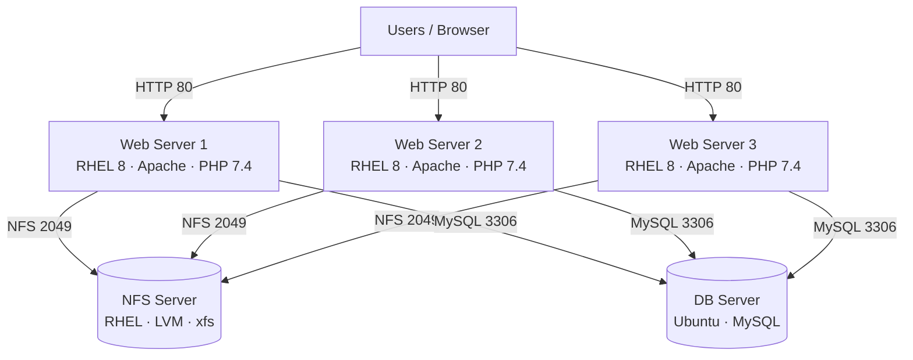
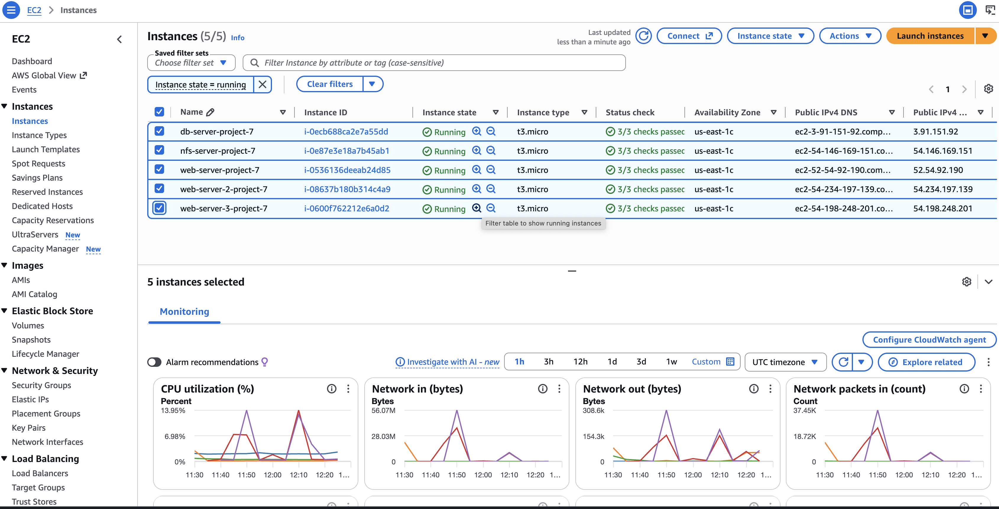
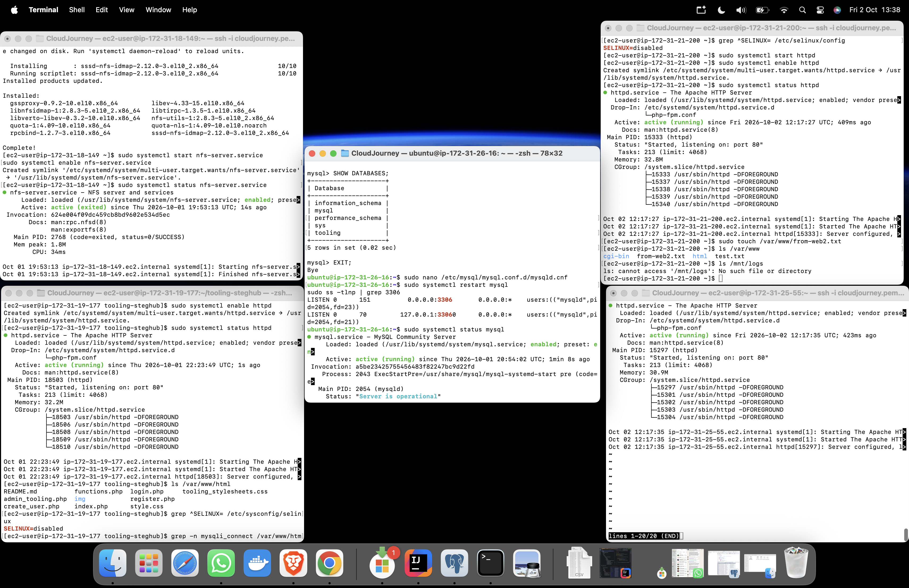
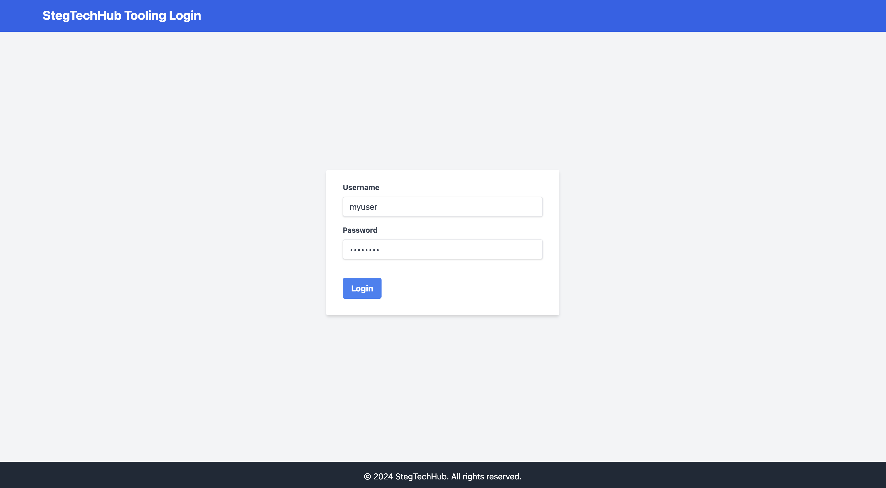
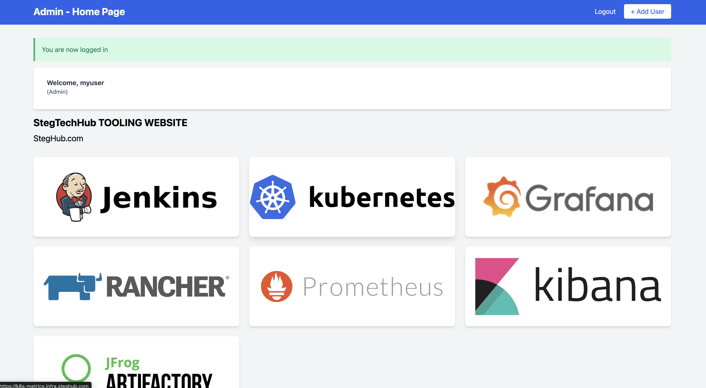
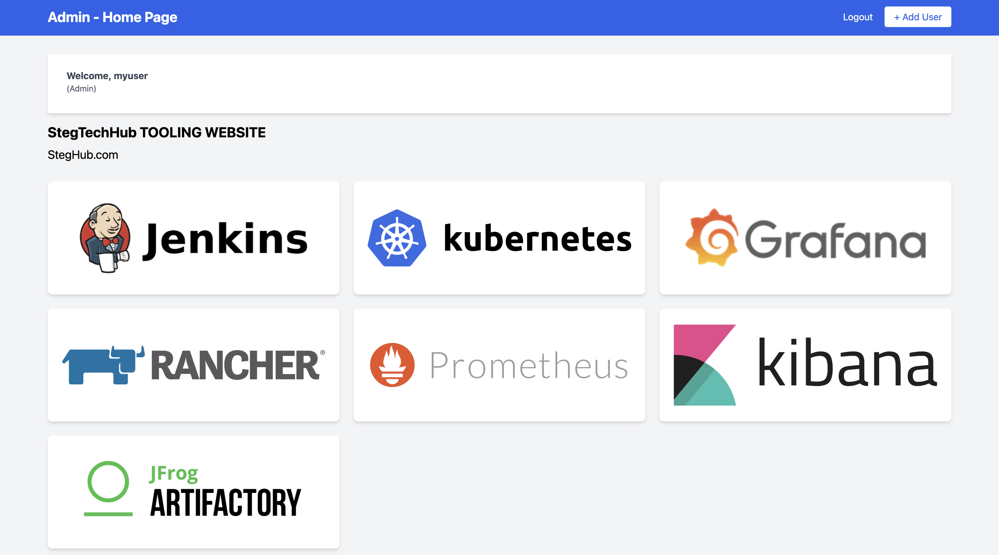
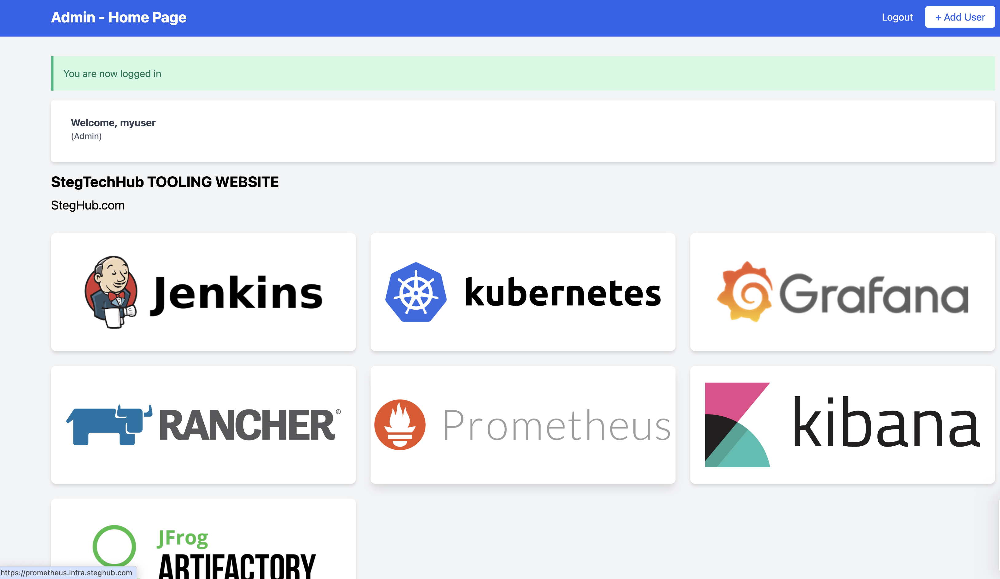

# Project 7: Three-Tier Web Solution with NFS and MySQL on AWS

A DevOps tooling website served by **three stateless Apache/PHP web servers** that share their website files and logs through an **NFS server** and use a single **MySQL database server**. Everything runs on AWS EC2.

## Architecture



| Tier | Server | OS | Purpose |
|---|---|---|---|
| Storage | `nfs-server-project-7` | RHEL 10 | Shared storage on LVM (`xfs`), exports `/mnt/apps`, `/mnt/logs`, `/mnt/opt` |
| Database | `db-server-project-7` | Ubuntu | MySQL database `tooling` |
| Web | `web-server-project-7`, `web-server-2-project-7`, `web-server-3-project-7` | RHEL 8.10 | Apache + PHP 7.4 serving the tooling website |

All instances are `t3.micro`, in the same VPC, subnet and Availability Zone (`us-east-1c`). The subnet CIDR is `172.31.16.0/20`.

**Why this design:** the web servers hold no data of their own. Website files live on NFS and user data lives in MySQL, so web servers can be added or removed without losing anything.

## Security group rules

| Server | Port | Protocol | Source |
|---|---|---|---|
| NFS | 22 | TCP | My IP |
| NFS | 111 | TCP and UDP | `172.31.16.0/20` |
| NFS | 2049 | TCP and UDP | `172.31.16.0/20` |
| DB | 22 | TCP | My IP |
| DB | 3306 | TCP | `172.31.16.0/20` |
| Web servers | 22 | TCP | My IP |
| Web servers | 80 | TCP | `0.0.0.0/0` |

---

## Step 1: Prepare the NFS server

### 1.1 Launch and attach storage
1. Launch a RHEL EC2 instance named `nfs-server-project-7`.
2. Create three 10 GiB EBS volumes in the same Availability Zone and attach them (`/dev/sdf`, `/dev/sdg`, `/dev/sdh`).
3. SSH in and list the disks:

```bash
ssh -i <key>.pem ec2-user@<nfs-public-ip>
lsblk
```

The new disks appear as `nvme1n1`, `nvme2n1` and `nvme3n1`.

### 1.2 Partition the disks for LVM

```bash
sudo parted /dev/nvme1n1 --script mklabel gpt mkpart primary 0% 100% set 1 lvm on
sudo parted /dev/nvme2n1 --script mklabel gpt mkpart primary 0% 100% set 1 lvm on
sudo parted /dev/nvme3n1 --script mklabel gpt mkpart primary 0% 100% set 1 lvm on
lsblk
```

### 1.3 Create the physical volumes, volume group and logical volumes

```bash
sudo pvcreate /dev/nvme1n1p1 /dev/nvme2n1p1 /dev/nvme3n1p1
sudo vgcreate nfs-vg /dev/nvme1n1p1 /dev/nvme2n1p1 /dev/nvme3n1p1

sudo lvcreate -n lv-opt  -L 9G nfs-vg
sudo lvcreate -n lv-apps -L 9G nfs-vg
sudo lvcreate -n lv-logs -L 9G nfs-vg

sudo pvs && sudo vgs && sudo lvs
```

### 1.4 Format as xfs and mount

```bash
sudo mkfs -t xfs /dev/nfs-vg/lv-opt
sudo mkfs -t xfs /dev/nfs-vg/lv-apps
sudo mkfs -t xfs /dev/nfs-vg/lv-logs

sudo mkdir -p /mnt/apps /mnt/logs /mnt/opt
sudo mount /dev/nfs-vg/lv-apps /mnt/apps
sudo mount /dev/nfs-vg/lv-logs /mnt/logs
sudo mount /dev/nfs-vg/lv-opt  /mnt/opt
```

Make the mounts persistent using the UUIDs from `sudo blkid`:

```bash
sudo blkid | grep nfs--vg
sudo vi /etc/fstab
```

```
UUID=<lv-apps-uuid>  /mnt/apps  xfs  defaults  0 0
UUID=<lv-logs-uuid>  /mnt/logs  xfs  defaults  0 0
UUID=<lv-opt-uuid>   /mnt/opt   xfs  defaults  0 0
```

```bash
sudo mount -a
sudo systemctl daemon-reload
df -h
```

| Logical volume | Mount point | Used by |
|---|---|---|
| `lv-apps` | `/mnt/apps` | Website files for the web servers |
| `lv-logs` | `/mnt/logs` | Apache logs from the web servers |
| `lv-opt` | `/mnt/opt` | Reserved for the Jenkins server in Project 8 |

### 1.5 Install and start NFS

```bash
sudo yum install nfs-utils -y
sudo systemctl start nfs-server.service
sudo systemctl enable nfs-server.service
sudo systemctl status nfs-server.service

sudo chown -R nobody: /mnt/apps /mnt/logs /mnt/opt
sudo chmod -R 777 /mnt/apps /mnt/logs /mnt/opt
sudo systemctl restart nfs-server.service
```

### 1.6 Export the mounts to the subnet

```bash
sudo vi /etc/exports
```

```
/mnt/apps 172.31.16.0/20(rw,sync,no_all_squash,no_root_squash)
/mnt/logs 172.31.16.0/20(rw,sync,no_all_squash,no_root_squash)
/mnt/opt  172.31.16.0/20(rw,sync,no_all_squash,no_root_squash)
```

```bash
sudo exportfs -arv
sudo exportfs -v
rpcinfo -p | grep nfs      # NFS listens on TCP 2049
```

Open TCP/UDP 111 and TCP/UDP 2049 in the NFS security group for `172.31.16.0/20`.

---

## Step 2: Configure the database server

### 2.1 Install MySQL (Ubuntu)

```bash
ssh -i <key>.pem ubuntu@<db-public-ip>
sudo apt update
sudo apt install mysql-server -y
sudo systemctl status mysql
```

### 2.2 Create the database and user

```bash
sudo mysql
```

```sql
CREATE DATABASE tooling;
CREATE USER 'webaccess'@'172.31.16.0/255.255.240.0' IDENTIFIED BY '<your-password>';
GRANT ALL PRIVILEGES ON tooling.* TO 'webaccess'@'172.31.16.0/255.255.240.0';
FLUSH PRIVILEGES;
SHOW DATABASES;
EXIT;
```

MySQL needs the netmask form of the host (`/255.255.240.0` is the same as `/20`), so the `webaccess` user can only connect from the web server subnet.

### 2.3 Allow remote connections

```bash
sudo vi /etc/mysql/mysql.conf.d/mysqld.cnf     # set: bind-address = 0.0.0.0
sudo systemctl restart mysql
sudo ss -tlnp | grep 3306
```

Open TCP 3306 in the DB security group for `172.31.16.0/20`.

---

## Step 3: Prepare the web servers

Repeat sections 3.1 to 3.7 on **all three** web servers. Section 3.8 is done once, on web server 1.

### 3.1 Add swap (1 GB RAM instances)

```bash
sudo dd if=/dev/zero of=/swapfile bs=128M count=8
sudo chmod 600 /swapfile
sudo mkswap /swapfile
sudo swapon /swapfile
echo '/swapfile swap swap defaults 0 0' | sudo tee -a /etc/fstab
free -h
```

### 3.2 Mount the NFS apps share on `/var/www`

```bash
sudo yum install nfs-utils nfs4-acl-tools -y
sudo mkdir /var/www
sudo mount -t nfs -o rw,nosuid <NFS-private-IP>:/mnt/apps /var/www
df -h
```

### 3.3 Install Apache

```bash
sudo yum install httpd -y
```

### 3.4 Install PHP 7.4 from the Remi repository

```bash
sudo dnf install https://dl.fedoraproject.org/pub/epel/epel-release-latest-8.noarch.rpm -y
sudo dnf install dnf-utils https://rpms.remirepo.net/enterprise/remi-release-8.rpm -y
sudo dnf module reset php -y
sudo dnf module enable php:remi-7.4 -y
sudo dnf install php php-opcache php-gd php-curl php-mysqlnd -y
sudo systemctl start php-fpm
sudo systemctl enable php-fpm
sudo setsebool -P httpd_execmem 1
php -v
```

### 3.5 Mount the Apache logs on the NFS logs share

```bash
sudo mount -t nfs -o rw,nosuid <NFS-private-IP>:/mnt/logs /var/log/httpd
```

### 3.6 Make both mounts persistent

```bash
sudo vi /etc/fstab
```

```
<NFS-private-IP>:/mnt/apps /var/www        nfs defaults 0 0
<NFS-private-IP>:/mnt/logs /var/log/httpd  nfs defaults 0 0
```

```bash
sudo mount -a
df -h | grep -E "www|httpd"
```

### 3.7 Disable SELinux and start Apache

```bash
sudo setenforce 0
sudo sed -i 's/^SELINUX=.*/SELINUX=disabled/' /etc/selinux/config
sudo systemctl start httpd
sudo systemctl enable httpd
sudo systemctl status httpd
```

### 3.8 Deploy the tooling website (web server 1 only)

Because `/var/www` is shared over NFS, web servers 2 and 3 pick up the code automatically.

1. Fork `https://github.com/StegTechHub/tooling` to your GitHub account.
2. Clone it and copy the `html` folder into the shared web root:

```bash
sudo yum install git -y
git clone https://github.com/<your-username>/tooling.git
cd tooling
sudo cp -R html/. /var/www/html
```

3. Point the site at the database in `/var/www/html/functions.php`:

```php
$db = mysqli_connect('<DB-private-IP>', 'webaccess', '<your-password>', 'tooling');
```

4. Load the schema and create an admin user:

```bash
sudo yum install mysql -y
mysql -h <DB-private-IP> -u webaccess -p tooling < tooling-db.sql
mysql -h <DB-private-IP> -u webaccess -p tooling
```

```sql
INSERT INTO users (id, username, password, email, user_type, status)
VALUES (2, 'myuser', '5f4dcc3b5aa765d61d8327deb882cf99', 'user@mail.com', 'admin', '1');
```

The stored value is an MD5 hash of a demo password. This is for a practice lab only and should never be used for real accounts.

5. Restart Apache:

```bash
sudo systemctl restart httpd
```

---

## Verification

### Shared storage
A file created on one web server appears on the others and on the NFS server:

```bash
sudo touch /var/www/from-web2.txt     # on web server 2
ls /var/www                           # on web servers 1 and 3
ls /mnt/apps                          # on the NFS server
```

### Shared logs
Apache logs from all web servers are written to the NFS server:

```bash
ls /mnt/logs                          # access_log  error_log
```

### Website
Open each web server in a browser and log in as the admin user:

```
http://<web-server-public-ip>/index.php
```

All three servers serve the same tooling website and authenticate against the same database.

## Screenshots

### Infrastructure
All five instances running on EC2:



SSH sessions into the NFS, DB and web servers, showing NFS, MySQL and Apache all active:



### Website
Login page:



Web server 1:



Web server 2:



Web server 3:



## Key concepts

- **LVM:** combining several disks into a volume group and carving logical volumes out of it.
- **NFS:** exporting storage to clients on a subnet and mounting it persistently with `/etc/fstab`.
- **Stateless web tier:** shared files on NFS and shared data in MySQL let web servers be added or removed freely.
- **Network security:** security groups scoped to the subnet CIDR so only the web tier can reach storage and the database.
- **Three-tier architecture:** separate presentation, storage and database tiers.


## Tech stack

AWS EC2 · EBS · RHEL 8 / RHEL 10 · Ubuntu · LVM · xfs · NFS · MySQL · Apache httpd · PHP 7.4 (Remi) · Git
